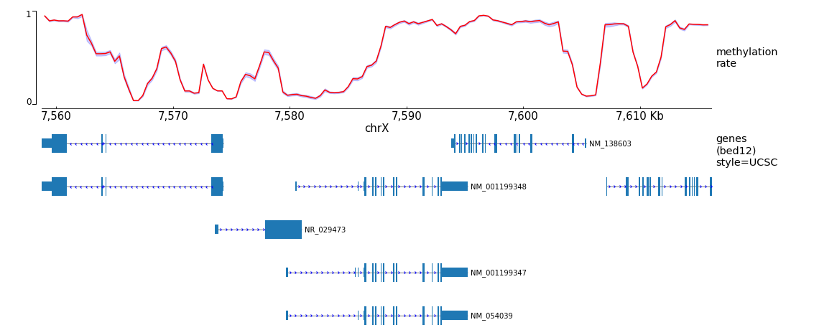
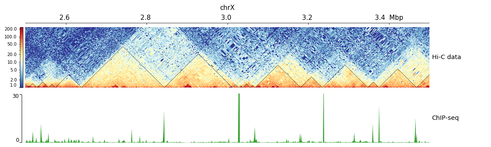
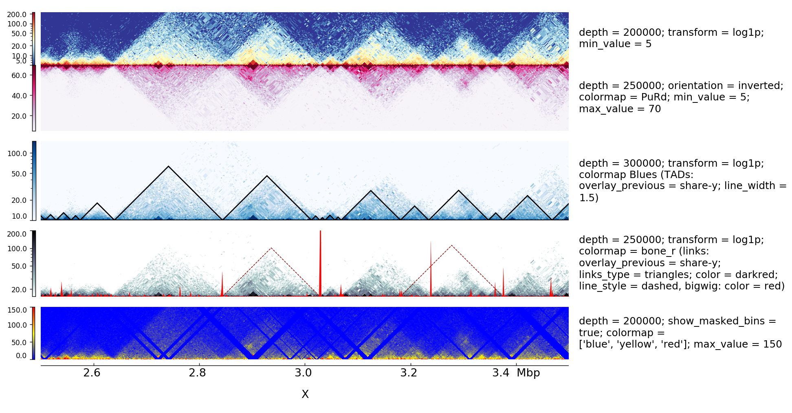

# skgGnomeTracks

Extended version from [pyGenomeTracks](https://github.com/deeptools/pyGenomeTracks)
==============

Standalone program and library to plot beautiful genome browser tracks
----------------------------------------------------------------------

skgGenomeTracks aims to produce high-quality genome browser tracks that
are highly customizable. Currently, it is possible to plot:

 * bigwig
 * bed (many options)
 * bedgraph
 * links (represented as arcs)
 * Hi-C matrices (if [HiCExplorer](http://hicexplorer.readthedocs.io) is installed)

skgGenomeTracks can make plots with or without Hi-C data. The following is an example output of pyGenomeTracks from [Ramírez et al. 2017](https://www.nature.com/articles/s41467-017-02525-w)


Installation
------------
skgGenomeTracks works with python >=3.6.


```bash
$ pip install git+https://github.com/skg-lab/skgGenomeTracks.git
```

update

```bash
$ pip install -U git+https://github.com/skg-lab/skgGenomeTracks.git
```

Usage
-----
To run skgGenomeTracks a configuration file describing the tracks is required. The easiest way to create this file is using the program `make_tracks_file` which creates a configuration file with
defaults that can be easily changed. The format is:

```bash
$ skg_make_tracks_file --trackFiles <file1.bed> <file2.bw> ... -o tracks.ini
```

`make_tracks_file` uses the file ending to guess the file type.

Then, a region can be plotted using:

```bash
$ skgGenomeTracks --tracks tracks.ini --region chr2:10,000,000-11,000,000 --outFileName nice_image.pdf
```

The ending `--outFileName` defines the image format. If `.pdf` is used, then the resulting image is a pdf. The options are pdf, png and svg.

To convert gene names into bed files, we merged [gene2bed](https://github.com/skg-lab/gene2bed).

```bash
$ gene2bed -h                       
usage: gene2bed.py [-h] [-m MERGIN] species genelist output

Convert a gene list into a bed file.

positional arguments:
  species               human or mouse
  genelist              a gene list file
  output                output file

optional arguments:
  -h, --help            show this help message and exit
  -m MERGIN, --mergin MERGIN   mergin length
```

input
```
Foxp3
Ctla4
Il2ra
```

output

```
chr1    60887000        60915832        Ctla4   0       +
chr2    11642807        11693193        Il2ra   0       +
chrX    7573644 7595245 Foxp3   0       +
```

this is example.

```bash
$ gene2bed mouse example/genelist.txt example/out.bed
```

references are below.

- human : Gencode v30
- mouse : Gencode vM21

data preparation (Only for the admins.)

```
bash prep_data.sh
```

## bed12 from Gencode

preparation

```
$ conda install -c bioconda ucsc-gtftogenepred
$ conda install -c bioconda ucsc-genepredtobed
```

implementation

```
$ cd examples/gencode
$ bash mkBed12fromGencode.sh
```

Citation
---------
If you use skgGenomeTracks in your analysis, you can cite the following paper :

Fidel Ramírez, Vivek Bhardwaj, Laura Arrigoni, Kin Chung Lam, Björn A. Grüning, José Villaveces, Bianca Habermann, Asifa Akhtar & Thomas Manke. High-resolution TADs reveal DNA sequences underlying genome organization in flies. Nature Communications (2018) [doi:10.1038/s41467-017-02525-w](https://www.nature.com/articles/s41467-017-02525-w)

Examples
--------

(These examples are found in the `examples/` folder)

A minimal example of a configuration file with a single bigwig track looks like this:

```INI
[bigwig file test]
file = bigwig.bw
# height of the track in cm (optional value)
height = 4
title = bigwig
min_value = 0
max_value = 30
```


```bash
$ skgGenomeTracks --tracks bigwig_track.ini --region X:2,500,000-3,000,000 -o bigwig.png
```


Now, let's add the genomic location and some genes:
```INI
[bigwig file test]
file = bigwig.bw
# height of the track in cm (optional value)
height = 4
title = bigwig
min_value = 0
max_value = 30

[spacer]
# this simply adds an small space between the two tracks.

[genes]
file = genes.bed.gz
height = 7
title = genes
fontsize = 10
file_type = bed
gene rows = 10

[x-axis]
fontsize=10
```

```bash
$ skgGenomeTracks --tracks bigwig_with_genes.ini --region X:2,800,000-3,100,000 -o bigwig_with_genes.png
```


Now, we will add some vertical lines across all tracks. The vertical lines should be in a bed format.

```INI
[bigwig file test]
file = bigwig.bw
# height of the track in cm (optional value)
height = 4
title = bigwig
min_value = 0
max_value = 30

[spacer]
# this simply adds an small space between the two tracks.

[genes]
file = genes.bed.gz
height = 7
title = genes
fontsize = 10
file_type = bed
gene rows = 10

[x-axis]
fontsize=10

[vlines]
file = domains.bed
type = vlines
```


```bash
$ skgGenomeTracks --tracks bigwig_with_genes_and_vlines.ini --region X:2,800,000-3,100,000 -o bigwig_with_genes_and_vlines.png
```


### Make bigwig files

use [deepTools](https://deeptools.readthedocs.io/en/develop/).

```bash
bamCoverage -b [BAM file] -o [BigWig file] -of bigwig --binSize 1 --smoothLength 1 --numberOfProcessors 1
```

## bismark 1bp resolution methylation rate.

supported Bismark Coverage (\*.bismark.cov.gz) files. By default, skgGenomeTracks plots a scatter plot
using the 4th column.

```
chr1    10563   10563   90.9090909090909        10      1
chr1    10571   10571   83.3333333333333        10      2
```


```
$ skgGenomeTracks --tracks bismark.ini --region chrX:7,558,768-7,616,151 -o bismark.png
```

```INI
[x-axis]
where = top

[bismark file]
file = bismark.bismark.cov.gz
# height of the track in cm (optional value)
height = 4
file_type = bismark
title = bismark
color = #9932cc
alpha = 1
size = 10
```

## Methylation rate line graph

input
```
chr start end methyl_sum de_methyl_sum per_methyl low ratio high
chrX    7265601 7267600 90      0       0.9891304347826086      0.9676158352635656      0.9924119338606987      0.9994364962522191
chrX    7266001 7268000 82      0       0.9880952380952381      0.9645504318541149      0.9916836033081886      0.9993821994187705
```

```
$ skgGenomeTracks --tracks methylation_rate_graph.ini --region chrX:7,558,768-7,616,151 --outFileName methylation_rate_graph.png
```

methylation_rate_graph.ini
```INI
[methylation_rate_graph]
file = test_methylation.mr #mr=methylation rate
file_type = methylation_rate_graph
title = methylation rate
height = 5
base_color = red
fill_between_color=blue
#size = 10
```


### Example methylation_rate_graph with genes

style=UCSC ver

methylation_rate_graph_ucsc.ini
```INI
[methylation_rate_graph]
file = test_methylation.mr
file_type = methylation_rate_graph
title = methylation rate
height = 5
base_color = red
fill_between_color=blue
#size = 10

[x-axis]

[genes]
file = mm10_ucsc.bed
height = 10
title = genes (bed12) style=ucsc
style=ucsc
fontsize = 10
```


```
$ skgGenomeTracks --tracks methylation_rate_graph_with_genes_ucsc.ini --region chrX:7,558,768-7,616,151 --outFileName methylation_rate_graph_with_genes_ucsc.png
```


style=flybase ver
```
$ skgGenomeTracks --tracks methylation_rate_graph_with_genes_flybase.ini --region chrX:7,558,768-7,616,151 --outFileName methylation_rate_graph_with_genes_flybase.png
```


Examples with peaks
-------------------

skgGenomeTracks has an option to plot peaks using MACS2 narrowPeak format.

The following is an example of the output in which the peak shape is
drawn based on the start, end, summit and height of the peak.

```INI
[narrow]
file = test.narrowPeak
height = 4
max_value = 40
title = max_value=40

[narrow 2]
file = test.narrowPeak
height = 2
show labels = no
show data range =  no
color = #00FF0080
use summit = no
title = show labels=no; show data range=no; use summit=no;color=#00FF0080
[spacer]

[narrow 3]
file = test.narrowPeak
height = 2
show labels = no
color = #0000FF80
use summit = no
width adjust = 4
title = show labels=no;width adjust=3

[spacer]

[narrow 4]
file = test.narrowPeak
height = 3
type = box
color = blue
title = type=box;color=blue;

[x-axis]
```


Examples with Hi-C data
-----------------------

The following is an example with Hi-C data overlay with topologically associating domains (TADs) and a bigwig file.

```INI
[x-axis]
where = top

[hic matrix]
file = hic_data.h5
title = Hi-C data
# depth is the maximum distance plotted in bp. In Hi-C tracks
# the height of the track is calculated based on the depth such
# that the matrix does not look deformated
depth = 300000
transform = log1p
file_type = hic_matrix

[tads]
file = domains.bed
display = triangles
border color = black
color = none
# the tads are overlay over the hic-matrix
# the share-y options sets the y-axis to be shared
# between the Hi-C matrix and the TADs.
overlay previous = share-y

[spacer]

[bigwig file test]
file = bigwig.bw
# height of the track in cm (optional value)
height = 4
title = ChIP-seq
min_value = 0
max_value = 30

```

```bash
$ skgGenomeTracks  --tracks hic_track.ini -o hic_track.png --region chrX:2500000-3500000
```



Examples with Epilogos
----------------------

skgGenomeTracks can be used to visualize epigenetic states (for example from chromHMM) as epilogos. For more information see: https://epilogos.altiusinstitute.org/

To plot epilogos a `qcat` file is needed. This file can be crated using the epilogos software (https://github.com/Altius/epilogos).

An example track file for epilogos looks like:

```INI

[epilogos]
file = epilog.qcat.bgz
height = 5
title = epilogos

[x-axis]
```


The color of the bars can be set by using a `json` file. The structure of the file is like this

```JSON
{
"categories":{
          "1":["Active TSS","#ff0000"],
          "2":["Flanking Active TSS","#ff4500"],
          "3":["Transcr at gene 5\" and 3\"","#32cd32"],
          "4":["Strong transcription","#008000"]
          }
}
```

In the following examples the top epilogo has the custom colors and the one below is shown inverted.

```INI
[epilogos]
file = epilog.qcat.bgz
height = 5
title = epilogos with custom colors
categories_file = epilog_cats.json

[epilogos inverted]
file = epilog.qcat.bgz
height = 5
title = epilogos inverted
orientation = inverted

[x-axis]
```


Examples with multiple options
------------------------------

A comprehensive example of skgGenomeTracks can be found as part of our automatic testing.
Note, that pyGenome tracks also allows the combination of multiple tracks into one using the parameter: `overlay previous=yes` or `overlay previous=share-y`.
In the second option the y-axis of the tracks that overlays is the same as the track being overlay. Multiple tracks can be overlay together.


The configuration file for this image is [here](./skggenometracks/tests/test_data/browser_tracks.ini)


Examples with multiple options for bigwig tracks
------------------------------------------------


The configuration file for this image is [here](./skggenometracks/tests/test_data/bigwig.ini)


Examples with Hi-C data
-----------------------

In these examples is where the overlay tracks are more useful. Notice that any track can be overlay over a Hi-C matrix. Most useful is to overlay TADs or to overlay links using the `triangles` option
that will point in the Hi-C matrix the pixel with the link contact. When overlaying links and TADs is useful to set `overlay previous=share-y` such that the two tracks match the positions. This is not
required when overlying other type of data like a bigwig file that has a different y-scale.



The configuration file for this image is [here](./skggenometracks/tests/test_data/browser_tracks_hic.ini)


Adding new tracks
-----------------
Adding new tracks to skgGenomeTracks only requires adding a new class to the `skggenometracks/tracks` folder.
The class should inherit the the `GenomeTrack` (or other track class available) and should have a `plot` method.
Additionally, some basic description should be added.

ファイルは`skggenometracks/tracks`に置き、`TextTrack.py`のように、クラス名と同じファイル名にする。クラスの命名規則は`MyClass`のようにアンダーバーなしの先頭大文字。

For example, to make a track that prints 'hello world' at a given location looks like this:

```python
class TextTrack(GenomeTrack):
    SUPPORTED_ENDINGS = ['.txt']  # this is used by make_tracks_file to guess the type of track based on file name
    TRACK_TYPE = 'text'
    OPTIONS_TXT = """
height = 3
title =
text =
# x position of text in the plot (in bp)
x position =
"""
    def plot(self, ax, chrom, region_start, region_end):
        """
        This example simply plots the given title at a fixed
        location in the axis. The chrom, region_start and region_end
        variables are not used.
        Args:
            ax: matplotlib axis to plot
            chrom_region: chromosome name
            start_region: start coordinate of genomic position
            end_region: end coordinate
        """
        # print text at position x = self.properties['x position'] and y = 0.5 (center of the plot)
        ax.text(float(self.properties['x position']), 0.5, self.properties['text'])

```

The OPTIONS_TXT should contain the text to build a default configuration file.
This information, together with the information about SUPPORTED_ENDINGS is used
by the program `make_tracks_file` to create a default configuration file
based on the endings of the files given.

The configuration file is:

```INI
[x-axis]
where = top

[new track]
file =
height = 4
title = new pyGenomeTrack
file_type = text
text = hello world
x position = 3100000
```

```bash
# sgt is short for `skgGenomeTracks`
sgt --tracks new_track.ini --region X:3000000-3200000 -o new_track.png
```


Notice that the resulting track already includes a y-axis (to the left) and
a label to the right. This are the defaults that can be changed by
adding a `plot_y_axis` and `plot_label` methods.

Another more complex example is the plotting of multiple bedgraph data as matrices. The output of `HiCExplorer hicFindTADs` produces a data format that
is similar to a bedgraph but with more value columns. We call this a bedgraph matrix. The following track plot this bedgraph matrix:

 ```python
import numpy as np
from skggenometracks.tracksClass import BedGraphTrack
from skggenometracks.tracksClass import GenomeTrack

 class BedGraphMatrixTrack(BedGraphTrack):
    # this track class extends a BedGraphTrack that is already part of
    # skgGenomeTracks. The advantage of extending this class is that
    # we can re-use the code for reading a bedgraph file
    SUPPORTED_ENDINGS = ['.bm', '.bm.gz']
    TRACK_TYPE = 'bedgraph_matrix'
    OPTIONS_TXT = GenomeTrack.OPTIONS_TXT + """
        # a bedgraph matrix file is like a bedgraph, except that per bin there
        # are more than one value (separated by tab). This file type is
        # produced by the HiCExplorer tool hicFindTads and contains
        # the TAD-separation score at different window sizes.
        # E.g.
        # chrX	18279	40131	0.399113	0.364118	0.320857	0.274307
        # chrX	40132	54262	0.479340	0.425471	0.366541	0.324736
        #min_value = 0.10
        #max_value = 0.70
        file_type = {}
        """.format(TRACK_TYPE)

    def plot(self, ax, chrom_region, start_region, end_region):
        """
        Args:
            ax: matplotlib axis to plot
            chrom_region: chromosome name
            start_region: start coordinate of genomic position
            end_region: end coordinate
        """

        # the BedGraphTrack already has methods to read files
        # in which the first three columns are chrom, start,end
        # here we used the get_scores method inherited from the
        # BedGraphTrack class
        values_list, start_pos = self.get_scores(chrom_region, start_region, end_region)

        # the values_list is a python list, containing one element
        # per row in the selected genomic range.
        # In this case, the bedgraph matrix contains per row a list
        # of values, thus, each element of the values_list is itself
        # a list.
        # In the following code, such list is converted to floats and
        # appended to a new list.
        matrix_rows = []
        for values in values_list:
            values = map(float, values)
            matrix_rows.append(values)

        # using numpy, the list of values per line in the bedgraph file
        # is converted into a matrix whose columns contain
        # the bedgraph values for the same line (notice that
        # the matrix is transposed to achieve this)
        matrix = np.vstack(matrix_rows).T

        # using meshgrid we get x and y positions to plot the matrix at
        # corresponding positions given in the bedgraph file.
        x, y = np.meshgrid(start_pos, np.arange(matrix.shape[0]))

        # shading adds some smoothing to the pllot
        shading = 'gouraud'
        vmax = self.properties['max_value']
        vmin = self.properties['min_value']

        img = ax.pcolormesh(x, y, matrix, vmin=vmin, vmax=vmax, shading=shading)
        img.set_rasterized(True)


    def plot_y_axis(self, ax, plot_axis):
        """turn off y_axis plot"
        pass
 ```


Let's create a track for this:

```INI
[bedgraph matrix]
file = tad_separation_score.bm.gz
title = bedgraph matrix
height = 8
file_type = bedgraph_matrix

[spacer]

[x-axis]
```

```bash
sgt --tracks bedgraph_matrix.ini --region X:2000000-3500000 -o bedgraph_matrix.png
```


Although this image looks interesting another way to plot
the data is a overlapping lines with the mean value highlighted.
Using the bedgraph version of `skgGenomeTracks` the following image
can be obtained:


skgGenomeTracks is used by [HiCExporer](https://hicexplorer.readthedocs.io/) and [HiCBrowser](https://github.com/maxplanck-ie/HiCBrowser) (See e.g. [Chorogenome navigator](http://chorogenome.ie-freiburg.mpg.de/) which is made with HiCBrowser)
